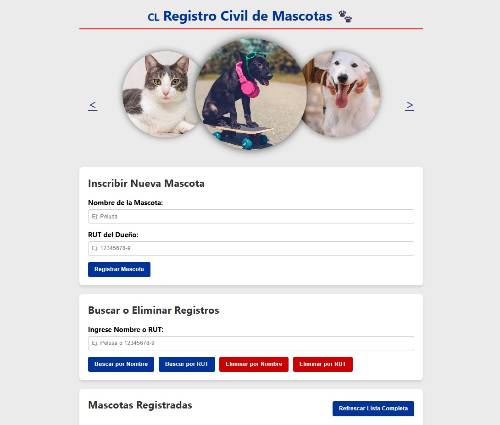

# Sistema de Registro de Mascotas

Proyecto desarrollado con Node.js y Express 

## Tecnologías utilizadas 

- Node.js
- Express
- dotenv
- axios

Requisitos:
- Node.js instalado

## Instalación

1. Instalar dependencias

npm install

2. Configurar variables de entorno

Crear un archivo `.env` basado en `.env.example` con tus puerto

5. Ejecutar el servidor

- productivo:
npm start

- desarrollo (ejecución automática al guardar cambios):
npm run dev

6. Ver sitio en navegador

ej: http://localhost:3000/

## Notas

- La carpeta `node_modules` no viene incluida.
- Las dependencias se instalan con `npm install`.
- El proyecto utiliza variables de entorno mediante `dotenv`

## Información Técnica

El servicio almacena el nombre de la mascota y el rut del dueño en un archivo en formato JSON. 
Métodos:
- GET sin parámetros: Retornar todas las mascotas con su correspondiente dueño.
- GET con el parámetro nombre: Retornar la mascota con ese nombre y el rut de su
dueño.
- GET con el parámetro rut: Retornar todas las mascotas asociadas a ese rut.
- POST: Inserta una mascota al archivo.
- DELETE con parámetro nombre: elimina la mascota con ese nombre (si es que
existe).
- DELETE con parámetro rut: elimina todas las mascotas asociadas a ese rut.

## Créditos:

<a href="https://www.magnific.com/es/foto-gratis/lindo-perro-cerca-caminando-parque-su-dueno_3389864.htm#fromView=search&page=3&position=13&uuid=f37d6879-ac2c-4a59-b6b8-c1b293ebb08f&query=dog">Imagen de senivpetro en Magnific</a>

<a href="https://www.magnific.com/es/foto-gratis/retrato-adorable-cocker-spaniel_6000709.htm#fromView=search&page=4&position=13&uuid=f37d6879-ac2c-4a59-b6b8-c1b293ebb08f&query=dog">Imagen de freepik</a>

<a href="https://www.magnific.com/es/foto-gratis/perro-amigo-lindo-canino-sonriente_2862000.htm#fromView=search&page=10&position=34&uuid=f37d6879-ac2c-4a59-b6b8-c1b293ebb08f&query=dog">Imagen de rawpixel.com en Magnific</a>

<a href="https://www.magnific.com/es/foto-gratis/adorable-gatito-blanco-negro-pared-monocromatica-detras-ella_13863382.htm#fromView=search&page=1&position=44&uuid=097abe3e-de38-4f47-b942-8d1851171b4b&query=gato">Imagen de freepik</a>

https://codepen.io/youfoundron/pen/qOeQao/

<a href="https://www.magnific.com/es/foto-gratis/grupo-animales-lindos_37152616.htm">Imagen de freepik</a>

<a href="https://www.magnific.com/es/foto-gratis/tiro-vertical-primer-plano-lindo-gato-luz-dia_17243025.htm#fromView=search&page=2&position=23&uuid=097abe3e-de38-4f47-b942-8d1851171b4b&query=gato">Imagen de wirestock en Magnific</a>

<a href="https://www.magnific.com/es/foto-gratis/retrato-adorable-gato-domestico_20083092.htm#fromView=search&page=2&position=35&uuid=097abe3e-de38-4f47-b942-8d1851171b4b&query=gato">Imagen de freepik</a>